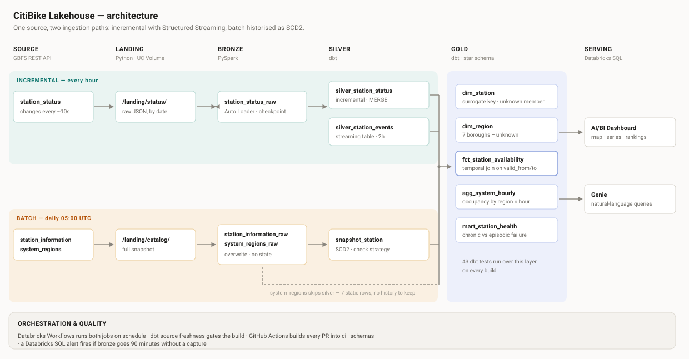
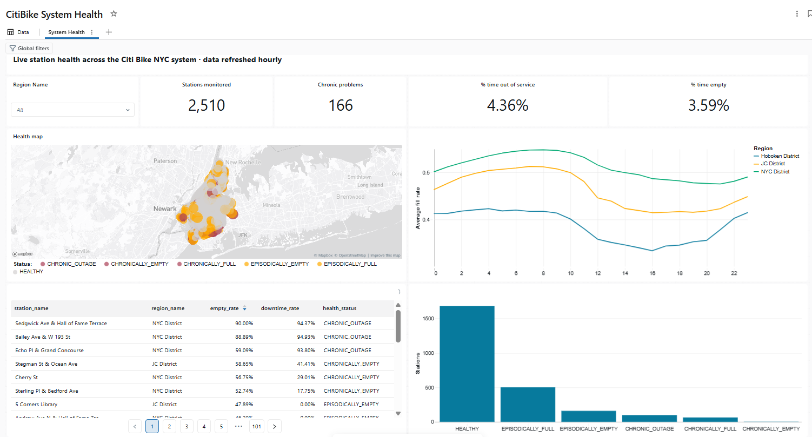
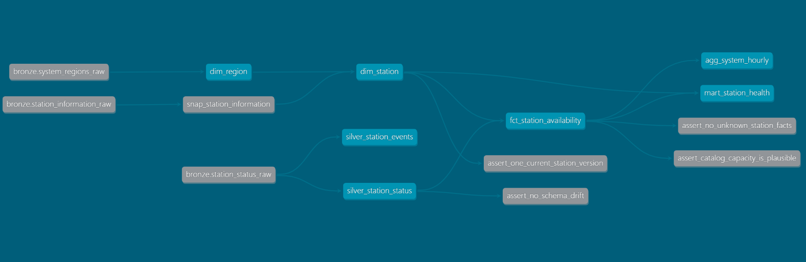

# CitiBike Lakehouse

A lakehouse over live Citi Bike NYC data, built on Databricks Free Edition.

The same source enters through two paths: one incremental, using Structured Streaming
with checkpoints, and one batch, historised as a type 2 slowly changing dimension. It
runs on its own every hour, tests itself on every pull request, and alerts if the
ingestion stalls.

**Repo:** [mauriciorostagno/citibike-lakehouse](https://github.com/mauriciorostagno/citibike-lakehouse)
· **More screenshots:** [docs/SHOWCASE.md](docs/SHOWCASE.md)



---

## What it does

Every hour it captures the state of around 2,500 bike stations from the public GBFS
feeds, lands the raw JSON, and turns it into a dimensional model that answers two
questions a bike-share operator actually has:

- Which stations are broken, and which ones just run out of bikes at rush hour?
- How does system occupancy move across the day, by borough?

Those are different problems with different owners. One is a maintenance ticket, the
other is a redistribution truck. The gold layer separates them in a column.



## Stack

Databricks Free Edition (serverless) · PySpark Structured Streaming · Auto Loader ·
Delta Lake · Unity Catalog · dbt · Databricks Workflows · GitHub Actions

## Architecture

| Layer | Tool | What happens |
|---|---|---|
| Landing | Python + requests | Raw JSON written to a Unity Catalog volume, partitioned by capture date. No transformation. |
| Bronze (stream) | PySpark + Auto Loader | Reads only unseen files, tracked in a checkpoint. `availableNow` trigger. |
| Bronze (batch) | PySpark | Full overwrite of the station catalog. No checkpoint, no incremental state. |
| Silver | dbt | Incremental model with MERGE, a streaming table for events, and an SCD2 snapshot. |
| Gold | dbt | Star schema plus two consumption marts. |
| Serving | AI/BI dashboard + Genie | Map, time series and rankings. Natural-language querying over gold. |



## Data source

[GBFS feeds](https://gbfs.lyft.com/gbfs/1.1/bkn/en) from Citi Bike NYC. No auth.

| Feed | Changes | Path |
|---|---|---|
| `station_status` | every ~10s | incremental |
| `station_information` | every few weeks | batch, SCD2 |
| `system_regions` | 7 rows, static | dimension |

## How it runs

| Job | Schedule | Tasks |
|---|---|---|
| `status_pipeline_hourly` | hourly | ingest -> bronze -> `dbt source freshness` -> `dbt build` |
| `catalog_pipeline_daily` | 05:00 UTC | ingest -> bronze |
| Streaming table pipeline | every 2 hours | refreshes itself |

The dbt task runs from this repository, so every execution runs exactly what is on
`main`. The freshness check goes before the build on purpose: if bronze has not received
data in six hours, the job stops rather than rebuilding gold on stale input.

A separate Databricks SQL alert checks every six hours that bronze has captured
something in the last 150 minutes. Two monitors, because one that lives inside the job
cannot report that the job stopped running.

Pull requests build the whole project into `ci_` schemas and run all 44 tests before
anything reaches `main`.

## Design decisions

**Spark cannot pull from a REST API incrementally.** There is no
`readStream.format("http")`, so extraction is plain Python. Incrementality starts once
the data has landed somewhere Spark can read.

**Incremental is a property of the read, not of the data.** The API always returns every
station. Auto Loader is incremental because of its checkpoint; dbt is incremental
because of `max(captured_at)` in the target.

**MERGE, not APPEND, in silver.** Bronze is append-only and can duplicate if a stream is
reprocessed. MERGE on `(station_id, captured_at)` makes the model converge to the same
result however many times it runs.

**A lookback window instead of a strict cutoff.** A strict `> max(captured_at)` would
silently drop a capture that landed late. The window re-reads recent rows and the MERGE
collapses them onto the same key.

**A streaming table for events, an incremental merge for state.** Streaming tables cannot
MERGE, so they suit immutable events and not corrected state. Materialisation follows the
semantics of the data.

**`check` over `timestamp` for the snapshot.** The feed has no reliable modified-at field
and `captured_at` moves every run, so a timestamp strategy would open a new version for
2,500 unchanged stations every day.

**The fill rate divides by the docks the station reports, not by catalog capacity.**
`capacity` comes from the catalog feed and sits below the live dock count on 1,828 of
2,509 stations. It is a nominal figure nobody keeps in sync. `total_docks` comes from the
same feed and the same instant as the numerator, which puts the ratio inside 0 to 1 by
construction. That lets the range test check something provable instead of a bound I
picked.

**One schedule per compute budget.** Free Edition gives a fixed 10-minute auto-stop that
cannot be changed and a daily compute allowance. A job every 30 minutes kept the
warehouse alive roughly eight hours a day and exhausted the allowance. Hourly captures
cost half that and still resolve the rush-hour pattern the analysis is about.

**The temporal join is the point of SCD2:**

```sql
and s.captured_at >= d.valid_from
and (d.valid_to is null or s.captured_at < d.valid_to)
```

An equality join on `station_id` would label a fact from three months ago with today's
name and region. This attaches the description that was on record when the measurement
was taken, which is also what dates a change in the source.

## Testing

44 tests, grouped by the risk each one covers.

| Family | Count | Catches |
|---|---|---|
| `not_null` | 23 | Orphaned rows and failed joins |
| `dbt_utils.accepted_range` | 8 | Impossible values, three of them scoped to operational stations |
| `unique` and `unique_combination_of_columns` | 6 | A model losing its declared grain |
| `accepted_values` | 2 | A CASE returning NULL because no branch matched |
| `relationships` | 1 | Broken referential integrity |
| Singular tests | 4 | Schema drift, dimension fan-out, orphaned facts, implausible catalog capacity |

Two of them warn instead of failing. Both flag conditions in the source that I cannot
fix from here, and neither one corrupts a number downstream.

## What I ran into

**The catalog changed a station's capacity from 39 to 1 overnight.** The fill rate for
that station jumped to 6.0, the range test failed, and the build stopped before
`agg_system_hourly` and `mart_station_health` could rebuild. Raising the bound would have
passed the test and pushed a 600% occupancy figure into the dashboard. Looking at the
rows instead showed the real problem: catalog capacity is below the live dock count on
most of the system, so it was never a denominator to divide by. The SCD2 dimension dated
the change to 08:57 that morning, which is how I knew it was the source and not the
model.

**972 events were labelled as demand when they were failures.** The event CASE checked
availability before service status. A switched-off station reports zero bikes, so every
dead station was filed under NO_BIKES. A ranking of "stations that run out of bikes"
would have been topped by broken hardware. Found by noticing 545 rows with
`is_renting = false` while the event log had zero NOT_RENTING events.

**`relationships` ignores NULLs.** It passed on five orphaned facts while `not_null`
failed on the same column. A relationships test without a not_null beside it is half a
validation.

**A failing test is not automatically a data problem.** `total_docks >= 1` failed on 924
rows because switched-off stations report zero docks. The assumption was wrong, not the
data. Scoping the test with `config: where:` was the fix; loosening the bound would have
hidden it.

**Auto Loader infers every column as STRING by default.** Without
`cloudFiles.inferColumnTypes=true`, nested JSON arrives as text and the explode fails.

**The checkpoint and the target table are one unit.** Deleting the checkpoint without
truncating the table turned 12,545 rows into 22,581. The deeper fix was silver merging
rather than appending, which makes that mistake stop mattering.

**A dbt token scoped to BI Tools cannot refresh a streaming table.** Streaming tables are
pipelines under the hood and need the `pipelines` scope alongside `sql`.

## Running it

```bash
cp .env.example .env          # add your Databricks token
python -m venv .venv && source .venv/bin/activate
pip install dbt-databricks==1.12.4

cd dbt
dbt deps --profiles-dir .
dbt build --profiles-dir .
```

The Databricks side (catalog, volumes, jobs) is in `databricks/`. Run
`databricks/sql/00_setup_unity_catalog.sql` first.

## Repo layout

```
databricks/notebooks/   Ingestion and bronze notebooks
databricks/sql/         Catalog setup, data quality checks, alert query
dbt/                    Models, snapshot, tests, macros
docs/SHOWCASE.md        Screenshots of the pipeline running
docs/PROJECT_STATE.md   Working notes and design rationale
.github/workflows/      CI
```

## Next

Citi Bike publishes historical trip data with origin and destination per ride. That turns
the availability snapshots into an origin-destination model and gives Spark a volume
worth the name. It deserves its own build rather than an appendix to this one.
