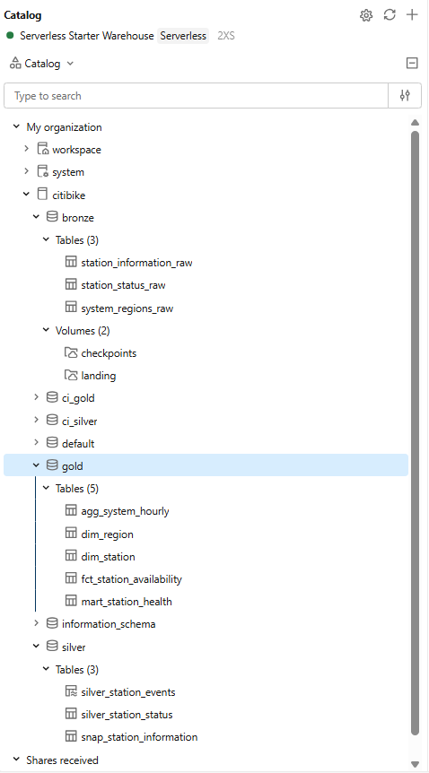
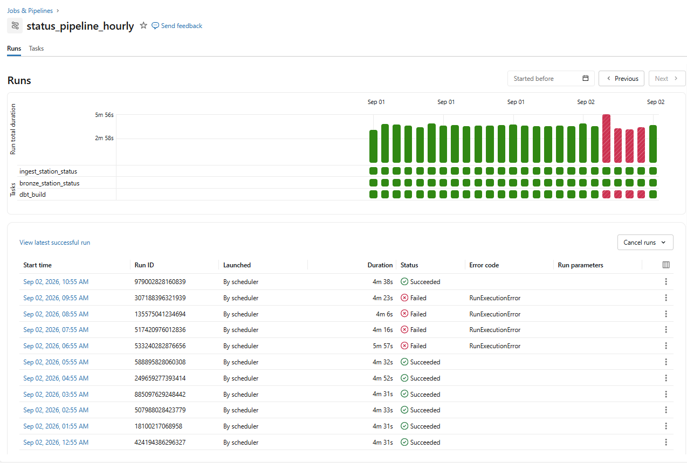
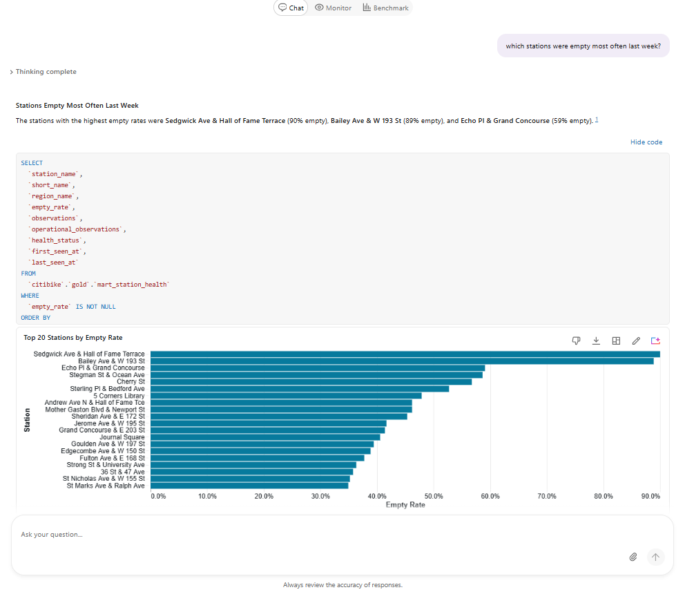
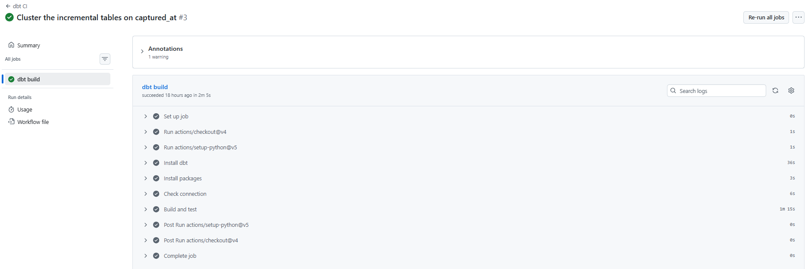

# Showcase

The pipeline running, in screenshots. The [README](../README.md) covers what it is and
why it was built that way; this page is the evidence that it works.

## Unity Catalog



One catalog, three layers plus the two the CI writes to. Bronze holds the raw tables and
the two volumes: `landing` for the JSON the ingestion job drops, `checkpoints` for the
Auto Loader state.

The `ci_gold` and `ci_silver` schemas are what pull requests build into. Nothing a PR
runs can touch the tables the dashboard reads.

## Scheduled runs



`status_pipeline_hourly`, one run per hour, three tasks each: ingest, bronze, dbt build.

The four red runs are real and I left them in. The catalog feed changed a station's
capacity, the fill rate went out of range, and the test stopped the build for four hours
until I looked at the data and changed the denominator. The bad number never reached the
dashboard, because the two marts that feed it were skipped instead of rebuilt on top of
it.

The README has the full story under "What I ran into".

## Model lineage


Generated by `dbt docs generate`. Three bronze sources on the left, two paths through
silver, the star schema and both marts on the right. The grey nodes on the right are the
singular tests, which is where `assert_catalog_capacity_is_plausible` sits.

## Genie



Genie answers over the gold layer in plain English, and shows the SQL it wrote. That
second part is what matters: the answer is only as good as the model underneath, and the
query it generated reads `mart_station_health` directly with no joins to untangle.

The column comments in the dbt schema files are what let it pick the right table.

## Continuous integration



Every pull request installs dbt, checks the connection, and builds the whole project into
the `ci_` schemas with all 44 tests. Around two minutes end to end.

`silver_station_events` is excluded from the CI build. It is a streaming table, and Free
Edition allows one active pipeline per type, which the scheduled refresh already uses.

## A build, end to end

```
13:24:57  Found 7 models, 43 data tests, 1 snapshot, 3 sources, 890 macros
13:24:57  Concurrency: 4 threads (target='dev')

13:25:07  1 of 46 START sql table model gold.dim_region ....................... [RUN]
13:25:07  2 of 46 START sql incremental model silver.silver_station_status .... [RUN]
13:25:07  3 of 46 START snapshot silver.snap_station_information .............. [RUN]
...
13:25:38  2 of 46 OK created sql incremental model silver.silver_station_status [OK in 31.03s]
13:26:12  25 of 46 OK created sql incremental model gold.fct_station_availability [OK in 25.43s]
13:26:16  27 of 46 PASS dbt_utils_accepted_range_fct_station_availability_bike_fill_rate__True__1__0 [PASS in 3.88s]
13:26:26  33 of 46 OK created sql table model gold.agg_system_hourly ........... [OK in 6.67s]
13:26:29  34 of 46 OK created sql table model gold.mart_station_health ......... [OK in 9.02s]

13:26:40  Finished running 2 incremental models, 1 snapshot, 4 table models,
          39 data tests in 0 hours 1 minutes and 43.16 seconds (103.16s).

13:26:41  Done. PASS=45 WARN=1 ERROR=0 SKIP=0 NO-OP=0 REUSED=0 TOTAL=46
```

The run above is the one right after the fill-rate fix. `bike_fill_rate` passes against
its new bound of 1, and both marts build instead of skipping.

The single warning is `assert_no_unknown_station_facts`. One station in the status feed
is not in the catalog feed, so its measurements land on the unknown member. That is by
design, and it warns every run so it stays visible.
